# WeatherRupert

A Go application that streams a retro WeatherStar(ish)-style weather channel into any IPTV application — [Channels DVR](https://getchannels.com), Plex, Emby, Jellyfin, TiviMate, or any player that supports M3U/XMLTV. It serves an M3U playlist, XMLTV guide, live MPEG-TS video stream, and HLS — all driven by a ZIP code in the request URL.

No headless browser. No Puppeteer. No WS4KP required. No API keys needed — all data comes from free public sources (NWS, NOAA, Iowa Mesonet, NASA SDO, Open Trivia DB).

Inspired by [WS4KP](https://github.com/netbymatt/ws4kp) and [ws4channels](https://github.com/rice9797/ws4channels). See [screenshots](#screenshots) below.

### Why?

I really loved the idea behind ws4channels serving WS4KP but wanted to push it further: drop the headless browser entirely, render everything procedurally in Go, and only do work when someone is actually watching. The goal is that the service does essentially nothing when it's not being used — no CPU, no network. When no viewers are connected, weather and solar data fetches pause, music stream connections are dropped, and the video encoder sleeps. Everything resumes automatically the moment a viewer tunes in. The result is a lightweight stream that serves both MPEG-TS and HLS to fit different home setups, and doubles as a family information board — weather, trivia, scrolling announcements, and background music all on one channel.

A secondary goal was to keep external imports to a minimum — the standard library does most of the heavy lifting, with only a handful of third-party packages where genuinely needed (2D drawing, font parsing, image decoding). Part of this was practical (fewer dependencies = less to break), but part was deliberate: I wanted to see how far AI-assisted coding could push a complex, real-world Go project while staying close to the standard library. It turned out to be a good stress test for the tooling.

Named in memory of my husband Robbie, known by some as Rupert — he was a force of nature.

---

## Usage

### Quick start

```bash
cp .env.example .env
docker compose up --build
```

Then add a custom channel source to your IPTV application:

```
http://<host>:9798/playlist.m3u?zip=90210
```

Replace `90210` with your ZIP code. Any IPTV app that supports M3U playlists and XMLTV guides (Channels DVR, Plex, Emby, Jellyfin, TiviMate, etc.) will discover the stream and guide URLs and add the channel automatically.

#### Channels DVR example

If both Channels DVR and WeatherRupert are running in Docker on the same host, use `http://127.0.0.1:9798` as the source URL. Under **Custom Channels**, add the M3U playlist URL as the source and the XMLTV guide URL for guide data:

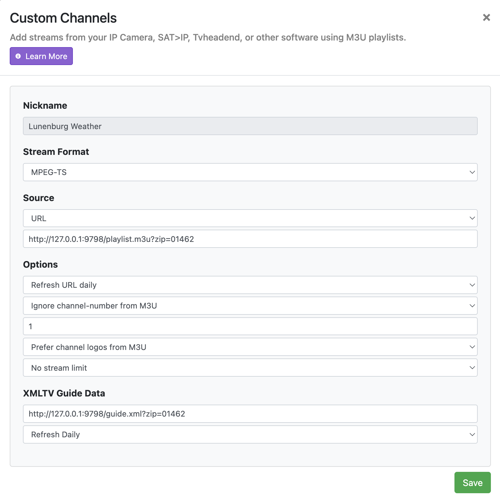

The M3U includes Channels DVR-specific metadata: channel logo (`tvg-logo`), live preview art (`tvc-guide-art`), genre and tag badges, and codec hints (`h264`/`aac`) for faster tuning. The guide art is a live snapshot of the current weather slide, updated each time Channels DVR refreshes the source.

### HLS playback

An HLS endpoint is available for browsers, Safari, VLC, smart TVs, and other standard HLS clients:

```
http://<host>:9798/live.m3u8?zip=90210
```

Open this URL directly in Safari, VLC (`vlc http://...`), or any HLS-compatible player. The stream starts within a few seconds and idles automatically when all viewers disconnect.

To use HLS instead of MPEG-TS in your IPTV app, use `format=hls` on the playlist URL:

```
http://<host>:9798/playlist.m3u?zip=90210&format=hls
```

### Endpoints

| Endpoint | Description |
|---|---|
| `GET /playlist.m3u?zip=XXXXX` | M3U playlist — add this URL to your IPTV app |
| `GET /guide.xml?zip=XXXXX` | XMLTV guide with hourly "Local Weather" entries |
| `GET /stream?zip=XXXXX` | Live MPEG-TS video stream |
| `GET /live.m3u8?zip=XXXXX` | HLS live playlist — use in Safari, web players, smart TVs |
| `GET /preview?zip=XXXXX` | PNG snapshot of the current slide — no stream required |
| `GET /health` | Health check |

All endpoints except `/health` require a `?zip=XXXXX` query parameter (5-digit US ZIP code). HLS segment requests (`/segment`) are made automatically by HLS clients using URLs from the playlist.

Optional query parameters:

| Parameter | Applies to | Values | Description |
|---|---|---|---|
| `clock` | all except `/health` | `12`, `24` | 12- or 24-hour time display (default: 24) |
| `units` | all except `/health` | `imperial`, `metric` | Unit system — imperial (°F, mph, mi, inHg) or metric (°C, km/h, km, hPa) (default: imperial) |
| `format` | `/playlist.m3u` only | `hls` | Generates a channel-list M3U pointing to the HLS stream instead of MPEG-TS |

Defaults for `clock` and `units` can be changed in the admin settings panel.

Multiple ZIP codes can run concurrently. Each ZIP gets its own independent pipeline, started on first request and cached for the life of the container.

### Admin interface

Visit `http://<host>:9798/admin/` to manage content live without restarting:

- **Dashboard** — live view of active pipelines, viewer counts, stream health, host load average, and container CPU usage
- **Announcements** — scrolling text shown between weather cycles
- **Trivia** — Q&A trivia slides shown between weather cycles
- **Settings** — slide duration, announcement/trivia intervals, clock format, unit system, satellite product, music streams

### Configuration

All settings are environment variables. Copy `.env.example` to `.env` to override defaults.

#### Display

| Variable | Default | Description |
|---|---|---|
| `TZ` | `America/New_York` | Timezone for time display on slides |
| `SLIDE_DURATION` | `8s` | How long each weather slide is shown before cycling |
| `VIDEO_WIDTH` | `1280` | Output frame width in pixels |
| `VIDEO_HEIGHT` | `720` | Output frame height in pixels |
| `FRAME_RATE` | `5` | Video frame rate (fps). 5 is recommended; higher values increase CPU significantly per stream. |
| `CHANNEL_NUMBER` | `100` | Channel number in the M3U playlist |
| `ADMIN_DATA_PATH` | `/data/settings.json` | Path for persisted admin settings |

#### Weather

| Variable | Default | Description |
|---|---|---|
| `WEATHER_API_URL` | `https://api.weather.gov` | NWS API base URL. Can point to a WS4KP server-mode proxy for caching. |
| `WEATHER_REFRESH` | `20m` | How often to re-fetch weather data from NWS |

#### Announcements & Trivia

| Variable | Default | Description |
|---|---|---|
| `ANNOUNCEMENT_INTERVAL` | `2` | Weather cycles between announcement slides (0 = disabled) |
| `TRIVIA_INTERVAL` | `3` | Weather cycles between trivia slides (0 = disabled) |

#### Trivia API

| Variable | Default | Description |
|---|---|---|
| `TRIVIA_API` | `true` | Fetch trivia from Open Trivia Database |
| `TRIVIA_API_AMOUNT` | `25` | Number of API questions to fetch (10–50) |
| `TRIVIA_API_CATEGORY` | `9` | Category ID (9 = General Knowledge; 0 = any; 9–32 = specific) |
| `TRIVIA_API_DIFFICULTY` | *(any)* | `easy`, `medium`, `hard`, or empty for any |
| `TRIVIA_API_REFRESH` | `24h` | How often to re-fetch questions (0s = startup only) |
| `TRIVIA_BUILTIN` | `false` | Include built-in/admin trivia in the pool |

#### Music

| Variable | Default | Description |
|---|---|---|
| `MUSIC_DIR` | `/music` | Directory of audio files for background music |
| `MUSIC_STREAM_URL` | *(empty)* | HTTP/Icecast stream URL. Pins a single stream for all pipelines (no rotation). When empty, admin-configured streams are used instead. |

#### Streaming

| Variable | Default | Description |
|---|---|---|
| `HLS_SEGMENT_DURATION` | `3s` | Duration of each HLS segment |
| `HLS_PLAYLIST_SIZE` | `3` | Number of segments in the HLS playlist |
| `HLS_RING_SIZE` | `5` | Number of segments kept in memory |

#### Video encoding

| Variable | Default | Description |
|---|---|---|
| `VIDEO_MAXRATE` | `1500k` | VBV max bitrate — smooths output so IPTV clients don't buffer underrun during static slides. Set to empty string to disable (pure VBR). |

#### Radar & Satellite

| Variable | Default | Description |
|---|---|---|
| `RADAR_FRAMES` | `4` | Number of animation frames (radar & satellite) |
| `RADAR_RADIUS` | `120` | Bounding box radius in miles (radar & satellite) |

The satellite product (infrared or visible) is configurable in the admin settings panel. Infrared is the default and works day and night; visible offers higher contrast but is blank after dark.

#### Performance tuning

Each ZIP code gets its own FFmpeg encoder pipeline. If you plan to run multiple concurrent streams (different ZIP codes), keep these in mind:

- **CPU limit** — the `docker-compose.yml` defaults to `cpus: "2.0"`. Each stream uses roughly 0.3–0.5 CPU cores at 5fps. If you run more than 3–4 concurrent streams, raise the limit accordingly.
- **Frame rate** — `FRAME_RATE=5` is the recommended default. Higher values increase encoding CPU proportionally with no visible benefit for static weather slides.
- **Music streams** — when multiple pipelines use the same music stream URL, a single HTTP connection is shared automatically. Different URLs each get their own connection but audio is passed through without re-encoding.

---

## Architecture

```
Request: /stream?zip=90210
         │
         ▼
    ┌─────────┐
    │ Manager │  Lazily creates and caches one Pipeline per ZIP code
    └────┬────┘
         │ geo.Lookup("90210") → 34.0901°N, 118.4065°W
         │
         ▼
    ┌──────────────────────────────────────────────────────┐
    │                      Pipeline                        │
    │                                                      │
    │  weather.Client ──────────────────────────►          │
    │  (api.weather.gov)          WeatherData              │
    │   /points → gridID                  │                │
    │   /forecast → daily periods         │                │
    │   /forecast/hourly → 12h periods    ▼                │
    │   /observations/latest    renderer.Renderer          │
    │                           (sbinet/gg 2D)             │
    │                           weather + special slides  │
    │                                  │                   │
    │                            raw RGBA frames           │
    │                                  │                   │
    │                                  ▼                   │
    │  MusicRelay ──────►       FFmpeg subprocess          │
    │  (shared HTTP              rawvideo → H.264          │
    │   audio stream)            audio → AAC               │
    │   via OS pipe              output: MPEG-TS           │
    │   (fd 3)                         │                   │
    │       ─ or ─                     │                   │
    │  local MP3s / silence            ▼                   │
    │                           stream.Hub                 │
    │                           (broadcast to N            │
    │                            HTTP clients)             │
    │                              │         │             │
    │                              │   HLSSegmenter        │
    │                              │   (3s segments        │
    │                              │    ring buf)          │
    │                              │     │    │            │
    │                              ▼     ▼    ▼            │
    │                           /stream /segment           │
    │                          (MPEG-TS) /live.m3u8        │
    │                                    (HLS)             │
    └──────────────────────────────────────────────────────┘
         │              │
         ▼              ▼
    IPTV apps      Safari / VLC / smart TVs
```

### Audio relay

When multiple pipelines use the same stream URL (e.g. several ZIP codes all playing the same internet radio station), a single `MusicRelay` opens one HTTP connection and fans out the raw audio bytes to every subscriber through OS pipes.

```
        Icecast / HTTP stream
                │
                ▼
        ┌──────────────┐
        │  MusicRelay  │  One per unique stream URL
        │  (HTTP GET)  │  Reconnects automatically on errors
        └──────┬───────┘
               │ 4 KB chunks
        ┌──────┼──────────┐
        ▼      ▼          ▼
     OS pipe  OS pipe   OS pipe     (one per subscribed pipeline)
     (fd 3)   (fd 3)    (fd 3)
        │      │          │
     FFmpeg  FFmpeg     FFmpeg
     ZIP A   ZIP B      ZIP C
```

Each subscriber has a buffered channel (256 chunks). If a pipeline's FFmpeg falls behind, excess chunks are dropped and counted as **AudioDrops** — visible in the admin dashboard.

The relay also tracks which subscribers are **active** (have viewers). When no pipeline has viewers the relay disconnects from the upstream stream to save bandwidth, and reconnects when a viewer arrives.

When multiple admin-configured streams exist, a pipeline rotates to a random stream each time a viewer reconnects. The pipe is detached from the old relay and attached to the new one without closing FFmpeg's input fd, so the transition is seamless.

### Packages

| Package | Role |
|---|---|
| `internal/config` | Loads and validates environment variables |
| `internal/geo` | Converts a ZIP code to lat/lon using an embedded Census ZCTA dataset (~33k ZIPs, no external API) |
| `internal/weather` | Fetches current conditions, hourly, and 7-day forecast from `api.weather.gov`. Fetches solar activity data (SDO images and NOAA SWPC metrics) hourly in a separate background goroutine. Refreshes weather every `WEATHER_REFRESH`; exposes data via an atomic pointer for lock-free reads. |
| `internal/renderer` | Draws weather slides using [sbinet/gg](https://sr.ht/~sbinet/gg/) (2D graphics) with embedded Inconsolata fonts. All weather icons (sun, moon, clouds, rain, snow, etc.) are procedurally generated — no image assets. Outputs raw RGBA frames at the configured frame rate. |
| `internal/stream` | Manages the FFmpeg subprocess (RGBA → H.264/AAC MPEG-TS), scans the music directory, broadcasts the MPEG-TS output to all connected HTTP clients via a buffered fan-out hub, provides HLS segmentation with an in-memory ring buffer for `/live.m3u8` playback, and implements `MusicRelay` — a shared HTTP audio stream that fans out to multiple pipelines via OS pipes. |
| `internal/guide` | Generates the M3U playlist and XMLTV guide XML. |
| `internal/announcements` | Announcement data type with optional date filtering (everyday or MM-DD specific). |
| `internal/trivia` | Trivia question types, built-in defaults, CSV persistence, and Open Trivia Database API fetching (multiple choice & true/false). |
| `internal/sysstat` | Reads host load average (`/proc/loadavg`) and container CPU usage (cgroup v2/v1) for the admin dashboard. Degrades gracefully on non-Linux (shows N/A). |
| `internal/admin` | Thread-safe store for announcements, trivia, and settings; serves the `/admin/` web UI. |
| `manager.go` | Creates and caches one `Pipeline` per (ZIP, clock format, unit system) tuple. Pools `MusicRelay` instances by stream URL so multiple pipelines share a single HTTP connection. Pipelines start on first request; weather bootstrap runs in the background so the stream begins immediately (showing a loading slide until data arrives). |

### Video pipeline detail

```
Go renderer                          Audio source (one of)
  └─ gg.Context (1280×720 RGBA)        ├─ MusicRelay pipe (fd 3) ← shared HTTP stream
       └─ raw RGBA bytes                ├─ local MP3s (concat demuxer, looped)
            (~3.5 MB/frame @ 5fps)      ├─ direct stream URL (-reconnect)
                 │                      └─ digital silence (lavfi aevalsrc)
                 │                           │
                 ▼                           ▼
            FFmpeg stdin               FFmpeg audio input
                 └──────────┬──────────────┘
                            ▼
                   ffmpeg -f rawvideo -pixel_format rgba ...
                        -c:v libx264 -preset ultrafast -tune zerolatency
                        -maxrate 1500k -bufsize 1500k
                        -c:a aac (or copy for relay/stream)
                        -f mpegts pipe:1
                            └─ stream.Hub reads stdout in 3KB chunks
                                 ├─ broadcasts to each /stream client channel
                                 │    └─ http.ResponseWriter + Flush()
                                 └─ HLSSegmenter (subscribes as a Hub client)
                                      └─ splits into 3s segments in ring buffer
                                           ├─ /live.m3u8 (M3U8 playlist)
                                           └─ /segment?seq=N (.ts data)
```

### Goroutines per pipeline

```
go wc.Bootstrap()     → resolves NWS grid + station, then:
go wc.Run()           → refreshes WeatherData every hour
go wc.runSolarRefresh → fetches SDO images + NOAA SWPC data hourly
go hub.Run()          → reads FFmpeg stdout, fans out to clients
go seg.Run()          → HLS segmenter: subscribes to hub, splits into 3s segments
go rnd.Run()          → frame ticker → renders slides → writes to FFmpeg stdin
go hub.ServeHTTP()    → one per connected MPEG-TS client
```

### Goroutines per MusicRelay (shared across pipelines)

```
go relay.run()        → connects to HTTP stream, broadcasts 4KB chunks to subscribers
go relay.writer()     → one per subscriber: reads channel → writes to OS pipe
```

### Design details

**SIGSTOP/SIGCONT for idle pipelines** — When all viewers disconnect from a pipeline, the FFmpeg subprocess is frozen with `SIGSTOP` at the OS level. It doesn't spin in a loop or decode silence — it's fully stopped by the kernel and consumes zero CPU. When a viewer reconnects, it's resumed with `SIGCONT`. This is the main mechanism behind the "does nothing when idle" goal.

**Flush window on resume** — Resuming a frozen FFmpeg creates a problem: old encoded frames and audio sit in FFmpeg's internal thread queue and OS pipe buffers from before the pause. Without intervention, the viewer hears a burst of stale audio. To handle this, the music relay drains stale audio from the kernel pipe buffer using non-blocking reads, and the broadcast hub discards all output for a flush window derived from the audio thread queue size (~1.7s). The window is reset at the actual moment of resume, not when the viewer first connects, so relay reconnection time doesn't eat into it.

**Lock-free weather reads via `atomic.Pointer`** — The renderer reads weather data on every frame (5 fps, ~3.5 MB RGBA per frame). Using `atomic.Pointer[WeatherData]` means the background refresh goroutine can swap in new data without ever blocking the render loop. No mutex on the hottest path in the system.

**Frame caching** — The renderer caches the last rendered frame and tracks four cache keys: current slide, tick within the slide, weather data timestamp, and announcement/trivia state. If nothing has changed, the cached frame is re-sent to FFmpeg without re-drawing. At 5 fps, most frames on static slides (current conditions, forecast) are identical, so this avoids redundant 3.5 MB allocations and 2D draw calls.

**Per-client drop tracking** — The broadcast hub sends MPEG-TS chunks to each connected client via a buffered channel. If a client can't keep up (slow network), its chunks are dropped individually rather than killing the connection or blocking other viewers. Drop counts are visible in the admin dashboard, making it easy to spot problematic clients without affecting everyone else.

**Procedural icons** — All weather icons (sun, moon, clouds, rain, snow, lightning, fog) are drawn algorithmically with 2D graphics primitives. No sprite sheets, no PNG assets. This keeps the binary self-contained and the icons resolution-independent.

**HLS keyframe-aligned segments** — The HLS segmenter doesn't split on wall-clock time. It accumulates MPEG-TS data and splits at actual H.264 keyframe boundaries, ensuring every segment starts at a random access point. This prevents decode errors when clients join mid-stream.

---

## Slides

The stream cycles through the following slides:

| Slide | Description |
|---|---|
| Weather Alerts | Active NWS alerts for the area (only shown when alerts exist) |
| Local Conditions | Current temperature, wind, humidity, and conditions |
| Hourly Forecast | 12-hour forecast with icons and temperatures |
| Precipitation | Chance-of-precipitation graph |
| Extended Forecast | 7-day daily forecast |
| Moon & Tides | Moon phase and NOAA tide predictions (coastal locations within 100 mi of a tide station) |
| Moon Phase | Moon phase only (inland locations with no nearby tide station) |
| Night Sky | Visible planet positions |
| Solar Weather | SDO solar imagery and NOAA space weather metrics |
| Satellite | Infrared or visible satellite imagery |
| Radar | Local weather radar |

Between weather cycles, optional special slides are inserted:

| Slide | Description |
|---|---|
| Announcements | Scrolling text messages configured in the admin panel |
| Trivia | Multiple-choice or true/false questions from Open Trivia DB or the admin panel |

---

## Music

Background audio plays continuously on the weather stream. There are three ways to provide it:

1. **Local files** — mount a directory of audio files (MP3, FLAC, OGG, WAV, M4A, AAC) into the container:

   ```yaml
   # docker-compose.yml
   volumes:
     - ./my-music:/music:ro
   ```

2. **Internet stream** — set `MUSIC_STREAM_URL` to an HTTP/Icecast URL (e.g. SomaFM):

   ```bash
   MUSIC_STREAM_URL=https://ice1.somafm.com/secretagent-128-mp3
   ```

3. **Admin panel** — add named music stream URLs at `/admin/settings`. When multiple streams are configured, each viewer session randomly selects one from the list. A pinned `MUSIC_STREAM_URL` disables rotation.

If no music source is configured, the stream runs in silence.

---

## RTSP / RTMP / WebRTC

An optional Docker Compose overlay adds a [MediaMTX](https://github.com/bluenviron/mediamtx) sidecar that republishes the weather stream over RTSP, RTMP, WebRTC, and SRT — useful for VLC, security camera software, set-top boxes, and other non-HTTP clients. This is experimental and not extensively tested.

```bash
docker compose -f docker-compose.yml -f docker-compose.rtsp.yml up --build
```

Once running, the stream is available at:

| Protocol | URL |
|---|---|
| RTSP | `rtsp://host:8554/weather` |
| RTMP | `rtmp://host:1935/weather` |
| HLS (MediaMTX) | `http://host:8888/weather` |
| WebRTC | `http://host:8889/weather` |
| SRT | `srt://host:8890` |

Set `RTSP_ZIP` in your `.env` to control which ZIP code is exposed (defaults to `90210`):

```bash
RTSP_ZIP=10001
```

Example VLC command:

```bash
vlc rtsp://localhost:8554/weather
```

Running `docker compose up` without the overlay works exactly as before — no RTSP services are started.

---

## Comparison with ws4channels

| | [ws4channels](https://github.com/rice9797/ws4channels) | WeatherRupert |
|---|---|---|
| Language | Node.js | Go |
| Weather rendering | Puppeteer screenshots WS4KP in a headless browser | Go renders frames natively |
| Weather data | WS4KP → api.weather.gov | api.weather.gov directly |
| WS4KP required | Yes | No |
| Headless browser | Yes (Puppeteer ~850 MB RAM) | No |
| Multiple ZIPs | No (one per container) | Yes (per-request, cached) |
| Output format | MPEG-TS | MPEG-TS + HLS |
| RAM usage | ~1 GB | ~100 MB |

**A note on visuals:** WS4KP (and by extension ws4channels) produces far more polished graphics — smooth animations, detailed radar overlays, and a faithful WeatherStar 4000 recreation. WeatherRupert's procedurally drawn slides are functional but nowhere near that level of visual quality. If presentation matters most, WS4KP is the better choice; WeatherRupert trades fidelity for a lighter, self-contained setup.

---

## Notes

- **Not for public hosting** — WeatherRupert has no authentication, no TLS, and no rate limiting. It is designed to run on a trusted home or internal network behind a firewall. Do not expose it directly to the internet.

- **Moon & Tides vs. Moon Phase** — At startup, WeatherRupert looks for the nearest NOAA tide station within 100 miles of the location. If one is found, the slide shows "Moon & Tides" with a tide prediction chart alongside the moon phase. For inland locations with no nearby tide station, the slide shows "Moon Phase" only with a larger moon display.

- **City name in guide vs. slides** — The XMLTV guide (`/guide.xml`) and M3U playlist (`/playlist.m3u`) always use the city and state from the embedded ZIP code database (e.g. "Beverly Hills, CA"). The on-screen weather slides may show a slightly different locality resolved from the NWS API during bootstrap — for example, NWS might return "Los Angeles" for the same ZIP because that's the nearest observation station. This is intentional: the guide stays consistent and instantly available, while the slides reflect what NWS considers the local forecast area.

---

## Screenshots

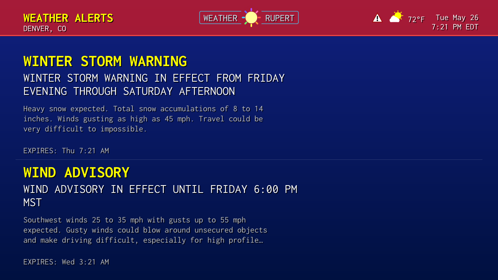
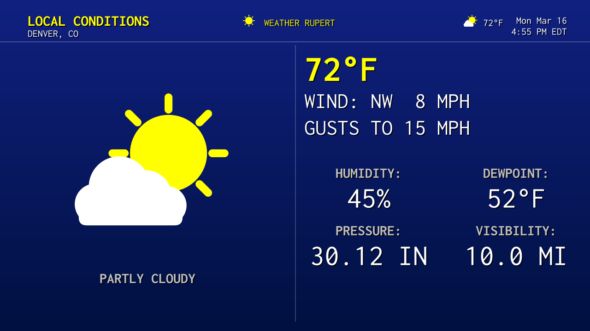
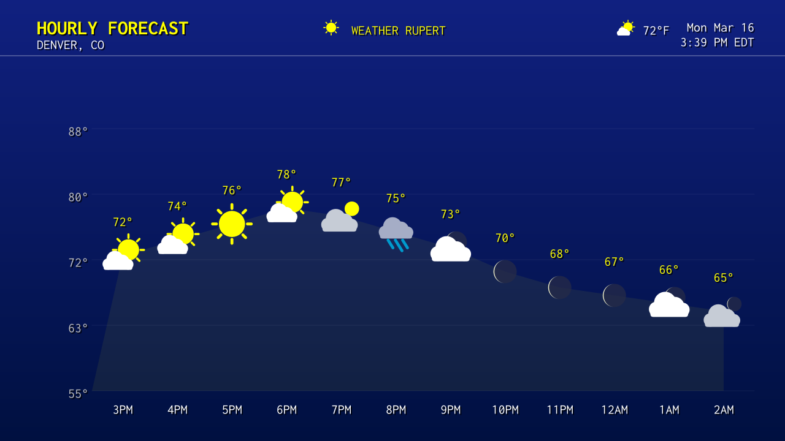
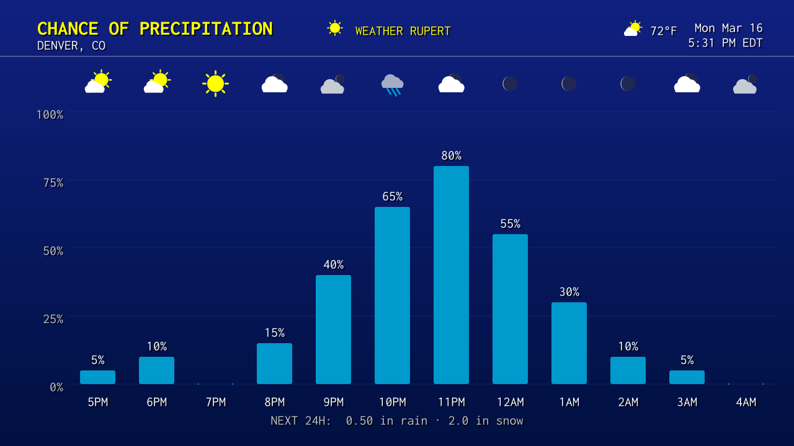
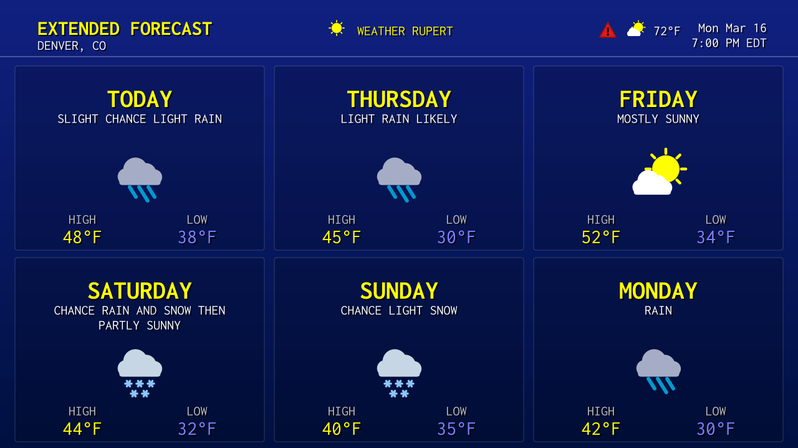
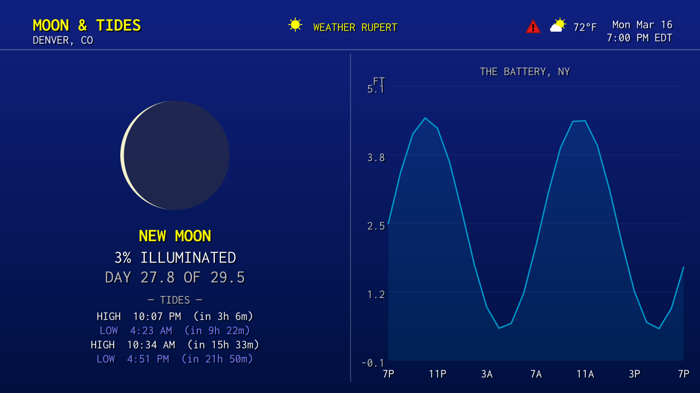
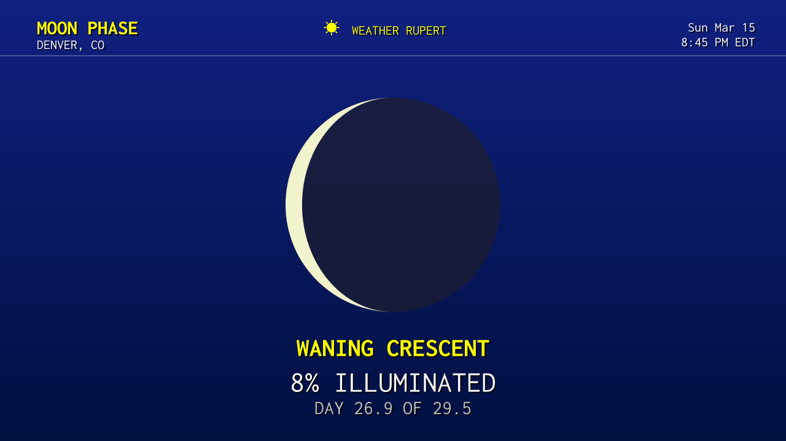
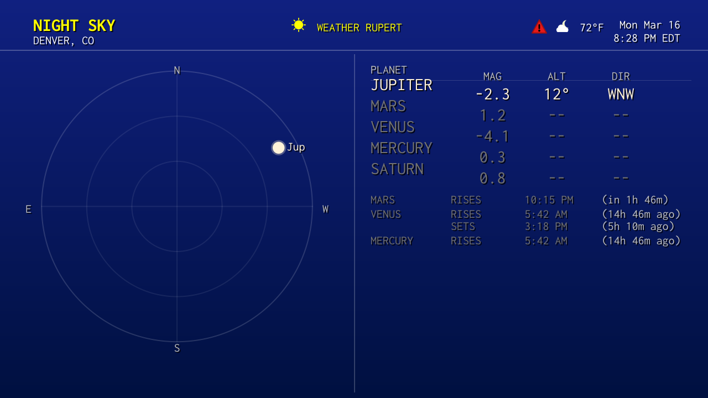
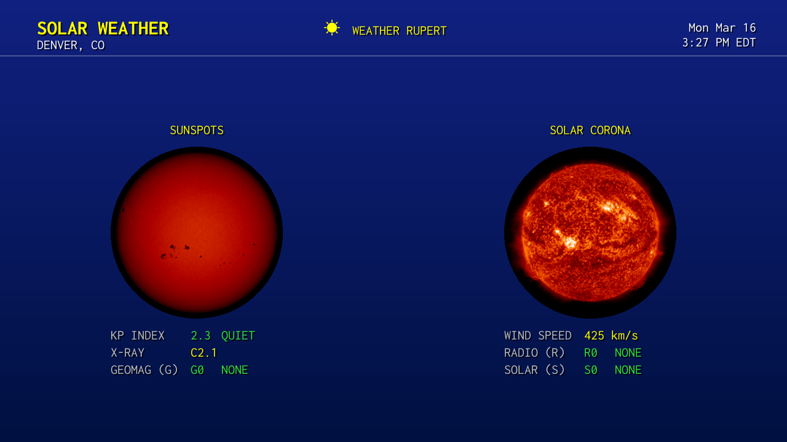
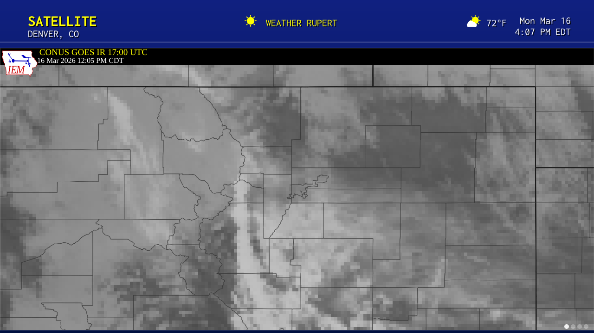
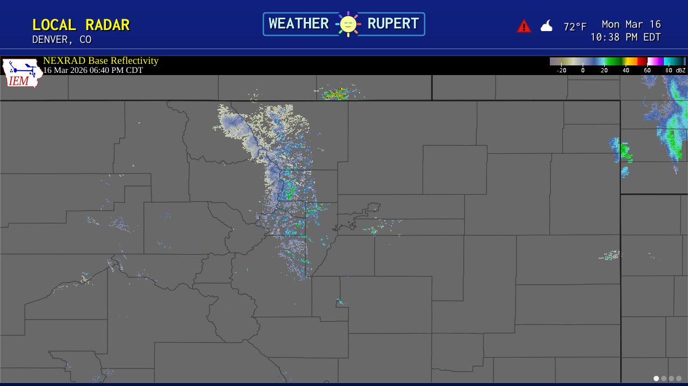
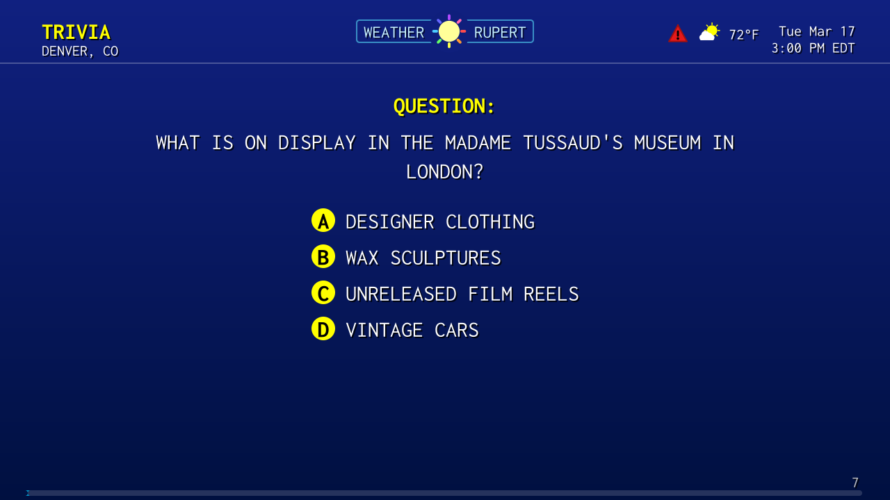
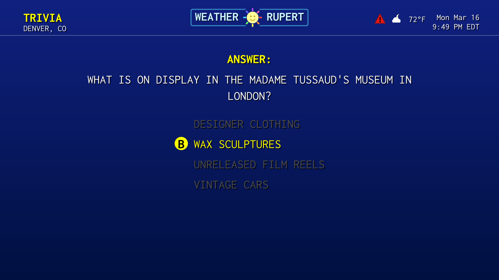
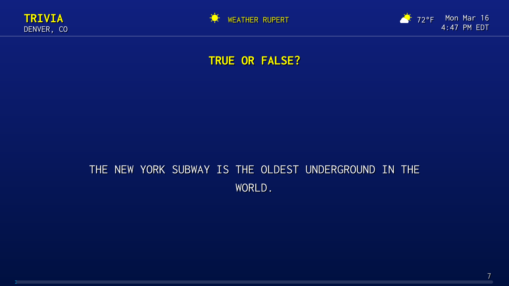
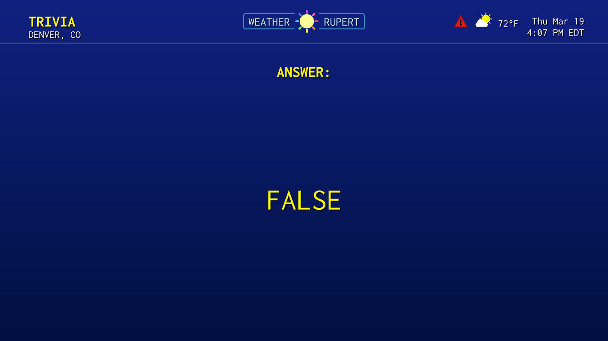

---

## Acknowledgments

Inspired by [WS4KP](https://github.com/netbymatt/ws4kp) and [ws4channels](https://github.com/rice9797/ws4channels) — WS4KP for its faithful WeatherStar 4000 recreation, and ws4channels for the idea of serving it as an IPTV channel.

Architecture and design by me. A good majority of the code was written with [Claude Code](https://claude.ai/claude-code) from Anthropic, which handled the bulk of the implementation, iteration, and bug hunting — making a project of this scope practical as a solo effort.

The default music streams ship with [SomaFM](https://somafm.com/) stations. I've been listening to SomaFM for years — they're listener-supported independent radio with no ads. If you enjoy the music, consider [supporting them](https://somafm.com/support/).

---

## License

MIT License with [Commons Clause](https://commonsclause.com/). Free to use, modify, and share — but not to sell. This software is provided as-is with no warranty. See [LICENSE](LICENSE) for details.
